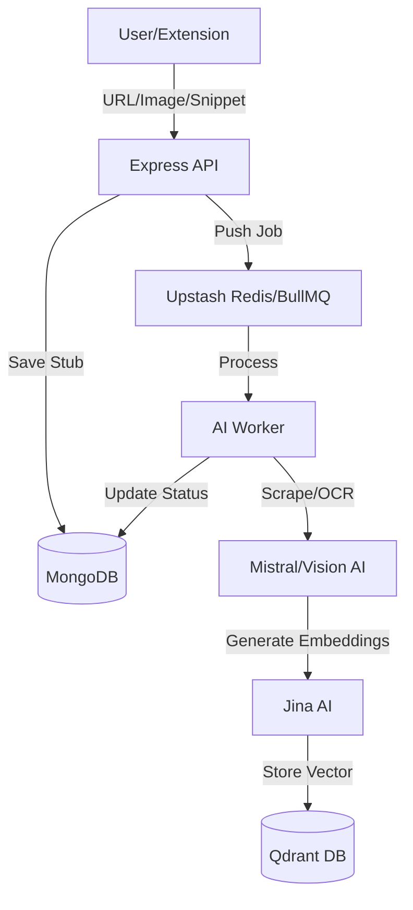
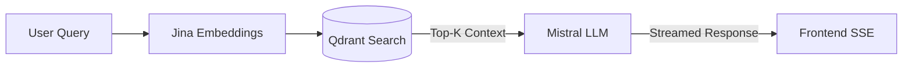

# NeuroVault 🧠 - AI-First Second Brain

NeuroVault is a high-performance **"Second Brain"** and personal knowledge management ecosystem. It seamlessly bridges the gap between raw information capture (web, images, highlights) and intelligent semantic retrieval.

By leveraging **Mistral AI**, **Qdrant Vector DB**, and **BullMQ** background workers, NeuroVault transforms static bookmarks into an interactive, chat-ready knowledge graph.

---

## 🛠 Technology Stack

### Frontend & UI

- **Framework**: React 19 (Vite)
- **Styling**: Tailwind CSS v4 (Glassmorphic design system)
- **Animations**: Framer Motion & GSAP
- **Icons**: Lucide React
- **Editor**: @blocknote/react (Notion-style block editing)
- **Visualization**: react-force-graph-2d (D3-based knowledge webs)

### Backend & Infrastructure

- **Server**: Node.js & Express.js
- **Auth**: Clerk (Identity & Session Management)
- **Primary DB**: MongoDB (Mongoose)
- **Vector DB**: Qdrant (Semantic Search & RAG)
- **Queue System**: Upstash Redis + BullMQ (Asynchronous AI processing)
- **Email**: Resend API (Weekly AI Digests)

### AI Core

- **LLM**: Mistral Large & Pixtral (Vision Analysis)
- **Embeddings**: Jina AI (v2 Base Embeddings)
- **Extraction**: Cheerio (Scraping), PDF-Parse (Docs), YouTube-Transcript

---

## 🚀 Key Features

- **Multimodal Capture**: Save raw URLs, YouTube videos, PDFs, or drag-and-drop images for AI Vision analysis.
- **Smart Highlighting**: A dedicated Chrome Extension allows you to highlight text on any site and "beam" it directly to your vault.
- **RAG Chat Interface**: Stream AI responses that are grounded in *your own* saved data using semantic context injection.
- **Knowledge Graph**: Visualize how your ideas connect through shared AI-generated tags and concepts.
- **Automated Organization**: AI detects topics and clusters into collections automatically, though you can still manage them manually.
- **Notion-Style Editing**: Edit your extracted notes using a powerful block-based editor.
- **Public Sharing**: Securely share curated collections with unauthenticated public links.
- **Weekly Digest**: Get an AI-synthesized recap of your week's captures delivered to your inbox.

---

## 🗺 System Architecture & Workflows

### 1. Data Ingestion Pipeline



### 2. Semantic Search & RAG Flow



---

## 📦 Getting Started

### Prerequisites

- Node.js v18+
- MongoDB Instance
- Qdrant Cloud Account (or Local Docker)
- Upstash Redis Account
- API Keys: Clerk, Mistral, Jina, Resend

### Installation

1.  **Clone the Repo**

    ```bash
    git clone https://github.com/beingthakur26/NeuroVault-v1.git
    cd NeuroVault-v1
    ```

2.  **Backend Setup**

    ```bash
    cd server
    npm install
    # Create .env with MONGODB_URI, QDRANT_URL, etc.
    npm run dev
    ```

3.  **Frontend Setup**

    ```bash
    cd client
    npm install
    # Create .env with VITE_CLERK_PUBLISHABLE_KEY, etc.
    npm run dev
    ```

4.  **Extension Installation**

    -   Open Chrome `chrome://extensions/`
    -   Enable "Developer mode"
    -   Click "Load unpacked"
    -   Select the `extension` folder in the project root.

---

## 📖 How to Use

1.  **Sign Up**: Register via Clerk on the landing page.
2.  **Capture**:
    -   Use the **Dashboard** "Save" box for URLs or File Uploads.
    -   Use the **Extension** button in your browser to save the current page or a text highlight.
3.  **Explore**:
    -   Go to **Saved Items** to view your vault.
    -   Click any item to edit with the **Block Editor**.
    -   Check the **Knowledge Graph** to see connections.
4.  **Chat**: Open **AI Chat** and ask questions like *"What did I save about machine learning last week?"*
5.  **Share**: Go to **Collections**, toggle a folder to `Public`, and copy the share link.

---

## 🛠 Future Roadmap

- [ ] Mobile App (React Native/Expo)
- [ ] Audio Transcription (Whisper AI)
- [ ] Bi-directional Backlinking (@references)
- [ ] Full-text Fuzzy Search (ElasticSearch)

Developed with ❤️ by the NeuroVault Team.

[Visit GitHub](https://github.com/beingthakur26/NeuroVault-v1.git)
kur26/NeuroVault-v1.git)
